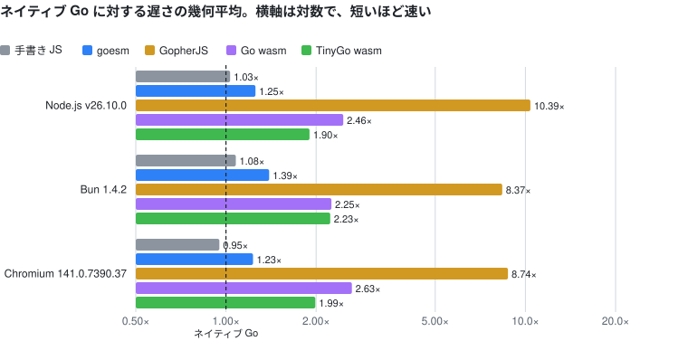
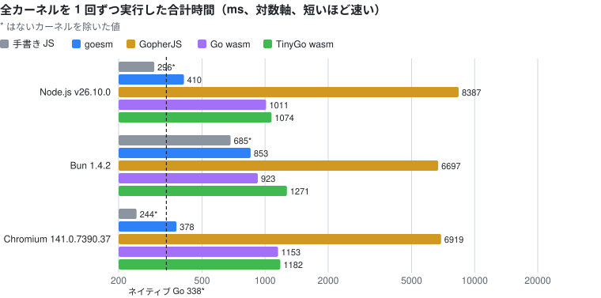

<h1 align="center"></h1>

[](https://github.com/goesm-dev/goesm/actions/workflows/ci.yml)
[](https://pkg.go.dev/github.com/goesm-dev/goesm)
[](go.mod)
[](https://github.com/goesm-dev/goesm/releases)
[](LICENSE)

[English](README.md)

Go のパッケージを、ネイティブな ES モジュールにコンパイルします。出力は TypeScript で、WebAssembly は使いません。

goesm は、普通の Go モジュールにある普通の Go パッケージを、パッケージごとに 1 つの ES モジュールに変換します。Vite、Rolldown、esbuild、Bun、Node.js、ブラウザからそのまま import できます。export された Go の関数は JavaScript の関数に、export された型は TypeScript の型を持つクラスになります。整数演算、スライス、マップ、インターフェース、goroutine、`defer` / `panic` / `recover`、ジェネリクス、リフレクションは Go と同じ意味で動き、その結果はネイティブ Go と突き合わせて検証しています。

> [!NOTE]
> goesm は実験段階です。現時点で動くものと動かないものは、[現状](#現状)を参照してください。

```go
package cart

type Item struct {
	Name     string
	Price    int
	Quantity int
}

func Total(items []Item) int {
	total := 0
	for _, item := range items {
		total += item.Price * item.Quantity
	}
	return total
}

func Discount(total, percent int) int {
	return total * (100 - percent) / 100
}
```

```ts
import { Discount, Total } from "./goesm-ts/example.com/app/cart.ts";

const items = [{ Name: "りんご", Price: 120, Quantity: 3 }, { Name: "bread", Price: 250, Quantity: 1 }];
Total(items);          // 610
Discount(2408, 15);    // 2046: Go の整数除算。2046.8 ではない
```

## goesm を使う理由

- **Go の関数がそのまま JavaScript の関数になります。** WebAssembly のインスタンスも、`wasm_exec.js` も、非同期のインスタンス化も、`syscall/js` 経由の値の変換もありません。`Discount` の呼び出しコストは普通の JS 関数の呼び出しと同じです。数値と真偽値は変換されずにそのまま境界を越え、文字列、配列、オブジェクトは宣言の型に従って Go の値に変換されます。
- **Go パッケージ 1 つが ES モジュール 1 つになります。** 出力は、相対 `.ts` 指定子で互いを import する TypeScript モジュールのツリーです。tree shaking、コード分割、minify、`.go` ファイルを指すソースマップの生成は、ホストのバンドラーが受け持ちます。TypeScript からは Go の API の型が見えます。
- **Go は Go のままです。** goesm は、Go のツールチェーンの go/packages と go/types をそのままフロントエンドとして使います。同じコードに対して `go.mod`、`go.work`、`gopls`、`go vet`、`go test` がそのまま使えます。goesm 独自の構文はありません。独自のディレクティブは `//goesm:import` だけで、JavaScript を呼ぶコードだけが使います。標準ライブラリも Go 自身のソースからコンパイルします。
- **ネイティブ Go と突き合わせて検証しています。** すべてのフィクスチャの結果を `go run` の結果と比較しています。Go 自身のテストスイートである `$GOROOT/test` も goesm で実行しています。

## 現状

PoC は Go 言語の大部分と、標準ライブラリのかなりの部分をコンパイルできます。

- **言語**: 関数とクロージャ、構造体、配列、スライス、マップ、ポインタ、インターフェース、型 switch、ジェネリクスと Go 1.27 のジェネリックメソッド、メソッド値、`defer` / `panic` / `recover`、goroutine、チャネル、`select`、整数と関数に対する range、`goto`、ラベル付き文、パッケージの初期化順序。
- **標準ライブラリ**: Go のソースからコンパイルします。`strings`、`strconv`、`unicode`、`sort`、`slices`、`maps`、`errors`、`math`、`math/bits`、`fmt`、`reflect`、`encoding/json`、`sync`、`time`、`os` の標準入出力などが動きます。`time` はホストのタイマーの上で動きます。goesm がまだ変換できない関数は、呼ぶと panic するスタブになります。スタブの一覧は `goesm build -v` で表示できます。
- **compile-time instrumentation**: OpenTelemetry の [otelc](https://github.com/open-telemetry/opentelemetry-go-compile-instrumentation) が計装したプログラムを、`goesm build -toolexec "otelc toolexec"` でビルドできます。ビルドしたプログラムは、ネイティブのビルドと同じ span を console や OTLP/HTTP の collector に出力します。package 間の `//go:linkname` と `//go:embed` も動きます。詳しくは [docs/otelc.ja.md](docs/otelc.ja.md) を参照してください。
- **Go のテストスイート**: `$GOROOT/test` の実行可能なテスト 961 件のうち 898 件が、ネイティブ Go と同じ出力になります。詳しくは [docs/conformance.ja.md](docs/conformance.ja.md) を参照してください。
- **ユースケース**: cobra を含む CLI、ビルドツール、サーバーサイドレンダリング、Node.js・Bun・Deno 上の `http.ListenAndServe` による HTTP と Connect のサーバー、Cloudflare Workers の fetch ハンドラとして動く同じ `http.Handler`、Connect のクライアント、DOM 操作、Go を呼ぶ React・Preact・Next.js のアプリに対応しています。どこで何に対応し、どう確認しているか、何が未対応かは [docs/use-cases.ja.md](docs/use-cases.ja.md) にまとめています。

まだできないことは次のとおりです。詳細は [ARCHITECTURE.ja.md §11](ARCHITECTURE.ja.md) にあります。

- `int` と `uint` は JS の number です。2^53 未満では正確ですが、64 ビットのオーバーフローで折り返しません。`int64` と `uint64` は BigInt で表すので正確です。
- goroutine ごとの `recover` の状態と、ホストに保留中の処理があるときのデッドロック検出は、まだ実装していません。

## インストール

goesm には Go 1.27 以降のツールチェーンが必要です。それより古い `go` は、`GOTOOLCHAIN` の仕組みで Go 1.27 を自動でダウンロードします。Node.js や npm は不要です。ランタイムの `@goesm/runtime` は goesm のバイナリに埋め込まれていて、出力に書き出されます。

自分のモジュールのツールとして追加すると、自分のコードと同じツールチェーンでビルドされます。

```sh
go get -tool github.com/goesm-dev/goesm/cmd/goesm@latest
go tool goesm emit-ts ./cart     # goesm-ts/<cart の import パス>.ts + goesm-ts/@goesm/runtime/
```

`PATH` にインストールすることもできます。

```sh
go install github.com/goesm-dev/goesm/cmd/goesm@latest
```

ビルド済みのバイナリは配布していません。goesm は動作中に必ず `go` を実行するので、Go のツールチェーンはいずれにしても必要です。また、自分のツールチェーンで goesm をビルドすると、goesm の go/types がモジュールの使う Go と同じバージョンになります。実験段階の間、リリースは `v0.0.1-beta.N` という名前のプレリリースとして [GitHub Releases](https://github.com/goesm-dev/goesm/releases) で公開します。`@latest` は最新のリリースを指します。`goesm version` は、goesm のバージョンと、goesm のビルドに使った Go のバージョンを表示します。

## 使い方

### `goesm emit-ts`: バンドラー向けの TypeScript ツリー

入力は、普通の Go モジュールでの普通の Go パッケージパターンです。

```sh
cd testdata/example
go run ../../cmd/goesm emit-ts -o goesm-ts ./main   # -o の既定は goesm-ts
```

```text
goesm-ts/
├── example.com/app/main.ts    import * as mathx from "./mathx.ts"
├── example.com/app/mathx.ts   import * as $rt from "../../@goesm/runtime/index.ts"
└── @goesm/runtime/
    ├── index.ts
    └── ...                    その他のランタイムのファイル
```

Go パッケージ `p` のモジュールは `<dir>/<p>.ts` に出力されます。標準ライブラリも同じで、`strings.ts` や `internal/bytealg.ts` のようになります。ランタイムは `<dir>/@goesm/runtime/` に出力されます。Go の import パスは `@` で始められないので、ランタイムの名前が Go のパッケージとぶつかることはありません。モジュールどうしは `.ts` で終わる相対指定子で import し合うので、リゾルバーもプラグインもバンドラーの設定も要りません。エントリのパッケージを自分のコードから import します。

```ts
// Vite プロジェクトの index.ts。bun index.ts や node index.ts で直接実行することもできる。Node.js は 22.18 以降が必要
import { Result } from "./goesm-ts/example.com/app/main.ts";
console.log(Result()); // 3
```

ツリーを import するコードを `tsc` で型検査するには `allowImportingTsExtensions` を有効にします。生成される TypeScript と JavaScript は [docs/example-output.ja.md](docs/example-output.ja.md) にあります。

### `goesm build`: バンドル済みの ES モジュール

`goesm build` は同じツリーを一時ディレクトリに書き出し、esbuild の Go API でバンドルします。バンドラーを使わない場合と、goesm 自身のテストのための機能です。

```sh
go run ../../cmd/goesm build ./main            # dist/main.js と、.go を指す dist/main.js.map を出力
go run ../../cmd/goesm build -minify ./main
go run ../../cmd/goesm build -split ./main     # Go パッケージごとに 1 つの ES モジュール: dist/example.com/app/main.js など
```

```js
import { Result } from "./dist/main.js";
Result(); // 3
```

出力は拡張子 `.js` の ES モジュールです。Node.js では、`package.json` に `"type": "module"` があるパッケージから読み込んでください。そうでないと Node.js はモジュール形式を判定するために各モジュールをもう一度パースし、大きなバンドルでは起動に数十ミリ秒が加わります。

### 再ビルド

goesm は、変換した各パッケージの TypeScript モジュールをキャッシュに保存します。キャッシュの場所は、ユーザーキャッシュディレクトリの `goesm/modules` です。`GOESMCACHE` で場所を変更でき、`GOESMCACHE=off` でキャッシュを無効にできます。再ビルドでは、モジュールが変わりうるパッケージだけを変換し直します。対象は、編集したパッケージ、それに依存するパッケージ、編集によってプログラム全体の解析結果が変わったパッケージです。たとえば、依存先の関数がコールバックを await する必要が新たに生じた場合は、その関数のパッケージが対象になります。出力は、キャッシュの有無にかかわらず同じです。goesm.dev の `site` パッケージは 77 個のパッケージを含みます。このパッケージの `emit-ts` は、キャッシュがない場合は 1.2 秒、1 つのパッケージを編集した後は 0.7 秒かかります。残りの時間は、Go のフロントエンドとプログラム全体の解析にかかります。

### JavaScript から Go を呼ぶ

- ビルドしたパッケージの export された関数は、そのモジュールの export になります。引数と戻り値は JavaScript の値で、Go の型に従って変換されます。文字列は JS の文字列、スライスは配列、構造体は `encoding/json` と同じ名前のフィールドを持つプレーンオブジェクト、`int64` / `uint64` は BigInt です。TypeScript にもこの型が見えます。たとえば `Total` の型は `Total(items: Array<{ Name?: string; Price?: number; Quantity?: number }> | null): number` です。
- メソッドを持つ構造体型へのポインタは Go のオブジェクトそのもので、JavaScript からそのメソッドを呼べます (`cart.Add(item)`)。
- 複数の戻り値は配列として返ります。最後の戻り値の `error` は `GoError` として投げられ、Go に渡し直すと元の Go のエラーに戻ります。
- チャネル操作、`time.Sleep`、ミューテックスの待ちのようにブロックしうる関数は、Promise を返す `async function` になります。それ以外の関数は同期関数です。

詳しくは [docs/js-exports.ja.md](docs/js-exports.ja.md) を参照してください。[examples/](examples) には、呼び出し側の JavaScript と組み合わせて実行できる例があります。

### Go から JavaScript を呼ぶ

本体のない関数を宣言すると、ES モジュールの関数を取り込めます。値の変換は Go の型に従います。

```go
//goesm:import "./format.ts" formatPrice
func formatPrice(yen int, currency string) string

//goesm:import "./api.ts" fetchUser await
func fetchUser(id string) (User, error) // Promise を待ち、例外と reject は error になる
```

文字列、スライス、マップ、構造体、関数、`js.Value`、`any` が境界を越えられます。構造体のプロパティ名は `encoding/json` と同じ規則で決まります。1 回の呼び出しは、JavaScript から同じ関数を呼ぶ場合より数ナノ秒多くかかるだけです。詳しくは [docs/js-imports.ja.md](docs/js-imports.ja.md) にまとめています。Vue コンポーネントは [gosfc](https://github.com/goesm-dev/gosfc) から使います。

### HTTP を処理する

`ServeMux`、Connect のサービス、ミドルウェアなどの `http.Handler` は、どのホストでも、ホスト自身のサーバーを通じてリクエストを処理します。

```go
// Node.js、Bun、Deno では、node:http、Bun.serve、Deno.serve が処理する。
log.Fatal(http.ListenAndServe(":8080", api.Handler()))
```

```ts
// Cloudflare Workers、Deno.serve、Bun.serve、Service Worker では、fetch ハンドラとして公開する。
import { Handler } from "./goesm-ts/example.com/app/api.ts";
export default { fetch: Handler() }; // 戻り値の http.Handler は fetch ハンドラになる
```

各リクエストは専用の goroutine で処理され、ボディは最初に全部読み込まれます。レスポンスはハンドラが戻った時点で送られます。ハンドラが flush した場合は、その時点からレスポンスがストリームになります。Server-Sent Events や Connect のサーバーストリーミングはこの仕組みで動きます。Workers では、`nodejs_compat` フラグを有効にすると、Worker のテキストバインディングとシークレットを `os.Getenv` で読めます。HTTP クライアントは `fetch` を使います。どこで何に対応しているかは [docs/use-cases.ja.md](docs/use-cases.ja.md) にまとめています。

## 性能

[bench/](bench) では、同じ Go のカーネルを goesm、[GopherJS](https://github.com/gopherjs/gopherjs)、Go 公式の `GOOS=js GOARCH=wasm`、[TinyGo](https://tinygo.org) の wasm ターゲットでコンパイルし、Node.js、Bun、Chromium で実行します。すべての結果をネイティブ Go と照合し、起動時間と出力サイズも計測します。ネイティブ Go と、同じカーネルを JavaScript で手書きしたものを基準として載せています。各カーネルの内容、出力のビルド方法と呼び出し方、公平性についての注意は [bench/README.ja.md](bench/README.ja.md) にあります。ランタイムごとの全数値は [bench/results/results.md](bench/results/results.md) にあります。

計測方法は次のとおりです。

- どの実装についても、事前にビルドした出力を読み込んでから計測します。ビルドと TypeScript から JavaScript への変換は事前に済ませるので、どの計測値にも含まれません。出力の読み込み、wasm のコンパイルとインスタンス化にかかる時間は、カーネルの時間には含めず、起動時間に含めます。
- ネイティブ Go については、`go build` で作ったバイナリの中で、同じ計測ループを Go で実行します。
- 手書き JS については、[bench/js/handwritten.mjs](bench/js/handwritten.mjs) を ES モジュールとしてそのまま読み込みます。
- goesm については、`goesm build -minify` が出力した TypeScript を、goesm に組み込まれた esbuild で 1 つの ES モジュール `kernels.js` にバンドルし、それを読み込みます。
- GopherJS については、`gopherjs build -m` が出力したスクリプトを読み込みます。Go wasm と TinyGo wasm については、`.wasm` ファイルと `wasm_exec.js` を読み込みます。
- 各カーネルは JavaScript から呼び出します。ウォームアップとして 300 ms 以上かつ 3 回以上実行したあと、10 回以上かつ 1000 ms 以上計測し、その中央値を結果とします。1 回の実行が遅いカーネルでは、10 回に届かなくても、3 回以上かつ合計 10 秒以上計測した時点で計測を終えます。
- Add、Upper、Handle では、JavaScript から関数を 1 回呼び出すのにかかる時間を測ります。goesm と wasm の時間には、JS の文字列と Go の文字列を相互に変換する時間が含まれます。この変換は、呼び出し側が実際に負担するコストだからです。

<!-- bench:start -->
- Intel(R) Xeon(R) Processor @ 2.10GHz (4 threads), linux 6.18.44-fc-v70
- goesm v0.0.1-beta.1-26-g4bfd0d9, go version go1.27.1 linux/amd64
- GopherJS 1.21.0+go1.21.13
- tinygo version 0.42.0 linux/amd64 (using go version go1.27.1 and LLVM version 22.1.4)
- Node.js v26.10.0, Bun 1.4.2, Chromium 141.0.7390.37
- 2026-10-05 に計測しました。各カーネルについて、300 ms 以上ウォームアップしたあと 10 回以上かつ 1000 ms 以上計測し、その中央値を結果としています。1 回の実行が遅いカーネルは、3 回以上かつ合計 10 秒以上で計測を終えています。





次の表は、ネイティブ Go に対する遅さを、カーネルごとの時間の比の幾何平均で示します。値が小さいほど速いことを表します。

| ランタイム | 手書き JS | goesm | GopherJS | Go wasm | TinyGo wasm |
| --- | ---: | ---: | ---: | ---: | ---: |
| Node.js v26.10.0 | 0.96× | **1.07×** | 10.42× | 2.50× | 1.83× |
| Bun 1.4.2 | 1.17× | **1.10×** | 8.94× | 2.38× | 1.90× |
| Chromium 141.0.7390.37 | 0.88× | **1.03×** | 8.74× | 2.63× | 1.77× |

次の表は、全カーネルを 1 回ずつ実行した合計時間を ms で示します。合計は各カーネルの中央値の和で、呼び出し系のカーネルはループ全体の時間を足しています。* の付いた値は、その実装にないカーネルを除いた合計です。値が小さいほど速いことを表します。

| ランタイム | 手書き JS | goesm | GopherJS | Go wasm | TinyGo wasm |
| --- | ---: | ---: | ---: | ---: | ---: |
| Node.js v26.10.0 | 269* | **351** | 8622 | 1039 | 847 |
| Bun 1.4.2 | 870* | **339** | 7267 | 1004 | 863 |
| Chromium 141.0.7390.37 | 239* | **308** | 7108 | 1182 | 775 |

次の表は、各実装がネイティブ Go と手書き JS に対して最も遅くなるカーネルと、その時間の比を示します。対象には次の段落の崖のカーネルも含みます。

| ランタイム | | goesm | GopherJS | Go wasm | TinyGo wasm |
| --- | --- | ---: | ---: | ---: | ---: |
| Node.js v26.10.0 | ネイティブ Go 比で最も遅いカーネル | 54.1× RSASign | 353× RSASign | **5.79× RSASign** | 9.17× Handle |
| Node.js v26.10.0 | 手書き JS 比で最も遅いカーネル | 108× RSASign | 4854× Add | **13.4× Upper** | 21.1× Handle |
| Bun 1.4.2 | ネイティブ Go 比で最も遅いカーネル | 98.4× Rand64 | 574× RSASign | **7.49× RSASign** | 10.5× Upper |
| Bun 1.4.2 | 手書き JS 比で最も遅いカーネル | 98.8× RSASign | 3224× Add | **18.3× Pull** | 31.3× Pull |
| Chromium 141.0.7390.37 | ネイティブ Go 比で最も遅いカーネル | 68.2× RSASign | 292× RSASign | 10.4× Upper | **8.90× Upper** |
| Chromium 141.0.7390.37 | 手書き JS 比で最も遅いカーネル | 107× RSASign | 4626× Add | 38.2× Upper | **32.6× Upper** |

次の表は、Node.js v26.10.0 での 1 回あたりの時間の中央値を ms で示します。ns/回 と書いた行だけは、JS から関数を 1 回呼び出すのにかかる時間を ns で示します。値が小さいほど速いことを表します。

| カーネル | 対象 | ネイティブ Go | 手書き JS | goesm | GopherJS | Go wasm | TinyGo wasm |
| --- | --- | ---: | ---: | ---: | ---: | ---: | ---: |
| Fib | 再帰呼び出し、int 演算 | 4.06 | 7.65 | 7.85 | 7.71 | 12.2 | **3.90** |
| Sieve | []bool、密なループ | 7.09 | 8.09 | 10.9 | 59.2 | 11.2 | **7.93** |
| Mandelbrot | float64 のループ | 9.96 | 11.3 | 11.4 | 11.5 | 11.2 | **10.1** |
| NBody | ポインタ経由の構造体の float64 フィールド | 8.14 | 7.71 | 8.78 | 676 | 8.72 | **5.99** |
| FNV32 | uint32 の乗算と xor | 10.7 | 11.2 | 11.2 | 16.3 | 11.8 | **10.5** |
| FNV64 | uint64 の乗算と xor | 11.0 | 41.6 | 14.4 | 272 | 12.9 | **10.8** |
| BinaryTrees | メモリ確保、GC | 52.3 | 43.2 | **50.2** | 60.7 | 214 | 118 |
| Interfaces | インターフェースのメソッド呼び出し | 16.8 | 11.5 | **23.4** | 39.2 | 72.8 | 25.2 |
| MapInt | map[int]int の挿入・検索・削除 | 29.0 | 24.0 | **27.2** | 45.6 | 63.2 | 97.3 |
| MapString | map[string]int での集計 | 7.42 | 22.7 | **16.9** | 119 | 24.3 | 62.8 |
| Strings | strings.Builder、strconv、Split、Join | 8.60 | 10.3 | 13.4 | 478 | 26.8 | **12.0** |
| Sort | sort.Ints、sort.Strings | 30.3 | 44.4 | 50.1 | 134 | 97.5 | **39.0** |
| JSON | encoding/json の Marshal + Unmarshal | 6.78 | 2.47 | **3.38** | 477 | 21.2 | 38.1 |
| Sprintf | fmt.Sprintf | 14.5 | 5.27 | **5.77** | 1306 | 51.8 | 40.7 |
| Channels | goroutine、バッファなしチャネル | 81.0 | — | 66.2 | 257 | 199 | **23.5** |
| Add, ns/回 | JS からの呼び出し: 数値 2 つを渡して 1 つ受け取る | — | 0.61 | **0.61** | 2947 | 5.03 | 1.72 |
| Upper, ns/回 | JS からの呼び出し: strings.ToUpper、文字列を渡して受け取る | 130 | 48.9 | **110** | 13280 | 656 | 667 |
| Handle, ns/回 | JS からの呼び出し: JSON のリクエストハンドラ、文字列を渡して受け取る | 2992 | 1301 | **1923** | 304050 | 13433 | 27437 |
| **全カーネルを 1 回ずつ実行した合計 ms** | | 341* | 269* | **351** | 8622 | 1039 | 847 |
| **ネイティブ Go 比の幾何平均** | | 1.00× | 0.96× | **1.07×** | 10.42× | 2.50× | 1.83× |

次の表は、崖のカーネルの Node.js v26.10.0 での時間を ms で示します。崖のカーネルとは、JS へのコンパイラがネイティブ Go や手書き JS より極端に遅くしやすい Go の書き方を測るカーネルです。上の幾何平均と合計には含めていません。

| カーネル | 対象 | ネイティブ Go | 手書き JS | goesm | GopherJS | Go wasm | TinyGo wasm |
| --- | --- | ---: | ---: | ---: | ---: | ---: | ---: |
| Parallel | 4 つの goroutine に分けた CPU 処理 | 8.46 | 26.5 | 32.6 | 63.1 | 36.9 | **18.3** |
| Rand64 | 構造体フィールドでの uint64 演算 | 2.09 | 21.7 | 18.1 | 104 | 3.50 | **1.63** |
| MaybeBlocking | 別の実装がブロックするインターフェースの呼び出し | 2.26 | 0.70 | 1.14 | 1.42 | 1.99 | **0.46** |
| Pull | iter.Pull | 3.98 | 1.11 | **2.23** | — | 8.96 | 10.8 |
| RSASign | crypto/rsa の 2048 ビット署名、math/big | 3.89 | 1.94 | 211 | 1372 | **22.5** | 34.1 |

次の表は起動時間を ms で示します。起動時間は、出力を読み込み始めてから関数を呼べるようになるまでの時間です。

| ランタイム | goesm | GopherJS | Go wasm | TinyGo wasm |
| --- | ---: | ---: | ---: | ---: |
| Node.js | 141 | 153 | 62.8 | **33.9** |
| Bun | 206 | 189 | 55.3 | **31.8** |
| Chromium | 107 | 155 | 88.1 | **36.5** |

次の表は出力サイズを示します。サイズには、カーネル一式と、カーネルが使う標準ライブラリが含まれます。

| | goesm | GopherJS | Go wasm | TinyGo wasm |
| --- | ---: | ---: | ---: | ---: |
| ファイル | `kernels.js` | `bench.js` | `bench.wasm` + `wasm_exec.js` | `bench.wasm` + `wasm_exec.js` |
| 非圧縮 | **756 KiB** | 1633 KiB | 5070 KiB | 1338 KiB |
| gzip -9 | **220 KiB** | 331 KiB | 1399 KiB | 504 KiB |
| brotli -11 | **175 KiB** | 242 KiB | 1029 KiB | 363 KiB |
<!-- bench:end -->

この数値から読み取れる goesm の現状は次のとおりです。

- **合計時間は、どのランタイムでも 4 つの変換方式の中で goesm が最も短く、Bun では手書き JS よりも短くなっています。** 全カーネルを 1 回ずつ実行すると、goesm は 0.31〜0.35 秒、TinyGo は 0.78〜0.86 秒、Go wasm は 1.00〜1.18 秒、GopherJS は 7.1〜8.6 秒かかります。手書き JS は、Channels を除いて 0.24〜0.87 秒です。ネイティブ Go に対する遅さの幾何平均は、goesm が 1.03〜1.10 倍、手書き JS が 0.88〜1.17 倍、TinyGo が 1.77〜1.90 倍、Go wasm が 2.38〜2.63 倍、GopherJS が 8.74〜10.42 倍です。Bun では goesm の幾何平均が手書き JS を下回ります。goesm の値は、最適化を始める前は 4.2〜4.6 倍でした。今回の計測は前回と異なるマシンで行ったため、時間を以前の版の表と比べることはできません。
- **幾何平均は、ネイティブ Go より遅いカーネルと速いカーネルが打ち消し合った値です。** Node.js では、手書き JS は Fib で 1.9 倍、FNV64 で 3.8 倍、MapString で 3.1 倍の時間がかかる一方、JSON では 0.36 倍、Sprintf では 0.36 倍、Upper では 0.38 倍の時間で済みます。これは、JSON と文字列の処理では JS エンジンの組み込み関数が Go の標準ライブラリより速いためです。goesm も同じ傾向を示します。goesm は、数値計算のカーネルではネイティブ Go の 0.99〜1.93 倍の時間がかかります。Sprintf、JSON、Upper、JSON ハンドラではどのランタイムでも、BinaryTrees と MapInt では Node.js と Chromium で、ネイティブ Go より短い時間で終わります。
- **JavaScript から呼ぶコストは wasm より小さくなっています。** goesm の関数は JS の関数そのものなので、`Add` の 1 回の呼び出しは手書き JS と同じく 0.60〜0.63 ns で終わります。wasm の export を直接呼ぶ場合、TinyGo は 1.7〜2.4 ns、Go wasm は 5.0〜6.3 ns かかります。Go wasm を `syscall/js` 経由で呼ぶと、1 回にマイクロ秒単位の時間がかかります。GopherJS は 1 回に 2.0〜3.0 µs かかります。文字列を渡して受け取る `Upper` の 1 回の呼び出しは、goesm が 108〜110 ns、wasm が 0.66〜1.4 µs、手書き JS が 35〜54 ns です。JSON のリクエストハンドラの 1 回の呼び出しは、goesm が 1.5〜2.1 µs、TinyGo が 17〜27 µs、Go wasm が 13〜14 µs、手書き JS が 0.71〜1.3 µs です。
- **手書き JS に並んだカーネルと、まだ差が大きいカーネルがあります。** goesm は、カーネルごとに手書き JS とネイティブ Go の速い方に近づくコードを出力します。たとえば、ループで使う uint64 のローカル変数は 32 ビットの整数 2 つで持ち、構造体の `json.Marshal` はその型のために生成したエンコーダを通します。FNV64 はネイティブ Go の 1.25〜1.33 倍で、BigInt を使う手書き JS の 2.4〜59 倍より速くなっています。Node.js では、Fib、Mandelbrot、FNV32、FNV64、MapString で、goesm は手書き JS との差が 5% 以内か、それより速くなっています。差が大きいのは、Upper の 2.0〜3.1 倍、Interfaces の 1.7〜2.0 倍、JSON ハンドラの 1.5〜2.9 倍、JSON の 1.4〜1.9 倍、Strings の 1.3〜1.4 倍です。
- **崖のカーネルは、Go と JavaScript の違いが表れる箇所を示します。** 崖のカーネルは、どれも Go と JavaScript の一方が速く処理し、もう一方では遅くなりうる処理です。goesm が最も遅いのは RSASign で、ネイティブ Go の 54〜80 倍、WebCrypto の 99〜108 倍の時間がかかります。math/big は 32 ビットのワードの乗算を float64 の演算で行います。BigInt は演算が定数時間で終わらないため使っていません。Rand64 は uint64 を構造体のフィールドに持ち、その値は BigInt です。goesm は、そのフィールドへの代入が続く間はフィールドをローカル変数に写して計算するようになり、Rand64 は BigInt を使う手書き JS の 0.83〜1.08 倍の時間で終わります。ネイティブ Go と比べると、Node.js と Chromium では 4.1〜8.7 倍、BigInt の演算が遅い Bun では 98 倍です。Pull は、関数リテラルで書いたシーケンスを goroutine ではなく JS のジェネレータとして進めるようになり、ネイティブ Go の 0.52〜0.58 倍、手書き JS のジェネレータの 2.0〜5.7 倍の時間がかかります。Parallel は JavaScript では 1 つのスレッドしか使えず、処理を順に実行する手書き JS とほぼ同じ時間がかかります。ブロックする実装を持つインターフェースを呼ぶ MaybeBlocking は、ネイティブ Go の 0.24〜0.50 倍です。RSA と Parallel の崖は、JavaScript が提供する機能から生じています。
- **起動時間は wasm より長く、出力サイズは 4 つの中で最も小さくなっています。** RSASign のため、カーネルには crypto/rsa と math/big が含まれます。goesm の出力は、起動に 107〜206 ms かかります。GopherJS は 153〜189 ms、Go wasm は 55〜88 ms、TinyGo は 32〜36 ms です。brotli で圧縮したサイズは、goesm が 175 KiB、GopherJS が 242 KiB、TinyGo が 363 KiB、Go wasm が 1029 KiB です。
- **残る差の原因は、値の表現にあります。** Interfaces では、インターフェースに入れた構造体ごとに箱を 1 つ余分に確保します。Upper と JSON ハンドラでは、JS の文字列を Go のバイト文字列として受け取るときに、ASCII かどうかを調べる走査を呼び出しごとに行います。JSON では、Go の構造体へのデコードが、`JSON.parse` で素のオブジェクトを作る手書き JS より重くなります。

## 仕組み

```text
.go ──► go/packages + go/types ──► goesm: Go の意味論 → TypeScript ──► バンドラー / ランタイム ──► ES モジュール
```

go/packages と go/types は Go のツールチェーンの一部です。バンドラーやランタイムには、Vite、Rolldown、esbuild、Bun、Node.js などを使えます。

goesm は、ソース言語については Go のツールチェーンを、出力については現代の JS ツールを権威として扱います。Go のパーサー、型システム、モジュールを置き換えることも、バンドラーを実装することもしません。goesm は、型検査済みの Go を TypeScript に変換し、TypeScript で書いた小さなランタイムと組み合わせます。主な設計判断は次のとおりで、すべて [ARCHITECTURE.ja.md](ARCHITECTURE.ja.md) で説明しています。

- コンパイルの単位は Go のプログラムではなく Go のパッケージです。goesm のプロジェクトに `package main` は要らず、どこから実行を始めるかは JS のアプリケーションが決めます。
- goroutine は協調的に動きます。goesm はプログラム全体を解析してブロックしうる関数を見つけ、それらをブロック箇所に `await` を置いた `async` 関数に変換します。それ以外の関数は、すべて普通の同期関数のままです。
- 標準ライブラリのパッケージは Go 自身のソースからコンパイルします。`runtime`、`reflect`、`internal/reflectlite`、`sync`、`syscall/js` など、gc ランタイムに結びついた少数のパッケージは、goesm 独自の Go ソースに置き換えます。Go の本体を持たない関数は、ランタイムで実装します。
- Go の各型は、実行時の型記述子を持ちます。インターフェース、型辞書を使うジェネリクス、構造体をキーにしたマップ、リフレクションは、この型記述子を使います。

設計を GopherJS と比べたものは [docs/gopherjs-comparison.ja.md](docs/gopherjs-comparison.ja.md) にあります。

### 目標と目標外

goesm は、`go.mod`、`go.work`、`go fmt`、`gopls`、`go test`、`go vet`、`golangci-lint`、`govulncheck` といった Go の開発体験をそのまま保ち、出力側では JavaScript エコシステムのツールを再利用することを目指します。

goesm は、Go 風の言語、WebAssembly ランタイム、パッケージマネージャー、Vite や Rolldown の代替、フレームワークのいずれでもありません。フレームワークとの統合は別のアダプターの役割です。たとえば `<script setup lang="go">` を持つ Vue SFC は、Go の部分を goesm に渡し、テンプレート層は Vue が受け持つ、という形にできます。

## ドキュメント

- [ARCHITECTURE.ja.md](ARCHITECTURE.ja.md): 設計、値の表現、goroutine、標準ライブラリ、実装済みの範囲とネイティブ Go との違い
- [docs/use-cases.ja.md](docs/use-cases.ja.md): Node.js、エッジ、ブラウザでの対応範囲と未対応の項目
- [docs/concurrency.ja.md](docs/concurrency.ja.md): goroutine が 1 本の JavaScript スレッドで動く仕組み、データ競合とメモリ安全性の Go との違い
- [docs/js-imports.ja.md](docs/js-imports.ja.md): `//goesm:import` で Go から JavaScript と TypeScript を呼ぶ
- [docs/dom.ja.md](docs/dom.ja.md): `syscall/js` と型付きの DOM ライブラリで Go から DOM を使う
- [docs/example-output.ja.md](docs/example-output.ja.md): 生成される TypeScript と JavaScript
- [docs/conformance.ja.md](docs/conformance.ja.md): Go 自身のテストスイートを goesm で実行する
- [docs/otelc.ja.md](docs/otelc.ja.md): OpenTelemetry の compile-time instrumentation である otelc を goesm で使う
- [docs/gopherjs-comparison.ja.md](docs/gopherjs-comparison.ja.md): GopherJS との違い
- [bench/README.ja.md](bench/README.ja.md): ベンチマーク
- [examples/](examples): 実行できる例
- [CONTRIBUTING.ja.md](CONTRIBUTING.ja.md): 開発環境、方針、プルリクエストに必要なもの
- [docs/releasing.ja.md](docs/releasing.ja.md): リリースの手順

## 開発

```sh
mise install           # mise.toml で固定した Go、Node.js、Bun を入れる。CI も同じバージョンを使う
npm ci --prefix test   # TestTSC、TestOxlint、TestUseCaseEdge が使う tsc、oxlint、workerd を入れる。ローカルでは任意で、CI では必須
go test ./...          # Go 1.27 以降と Node.js 22.18 以降が必要。Bun は任意
```

`TestGolden` はフィクスチャの引数なしの export 関数をすべてネイティブ Go と goesm でビルドした ESM で実行し、結果が一致することを確認します。残りは `TestExamples`、`TestJS`、`TestTSC`、`TestOxlint`、オプトインの `TestGoConformance` が確認します。`TestTSC` は、出力した TypeScript を strict モードで型検査します。各テストとプルリクエストに必要なものは [CONTRIBUTING.ja.md](CONTRIBUTING.ja.md) にあります。

## ライセンス

goesm は [BSD 3-Clause License](LICENSE) で公開しています。`emit-ts` と `build` の出力には、コードが使う Go の標準ライブラリのパッケージを Go のソースからコンパイルしたものが含まれ、それらは [Go 自身の BSD スタイルのライセンス](https://go.dev/LICENSE) に従います。
