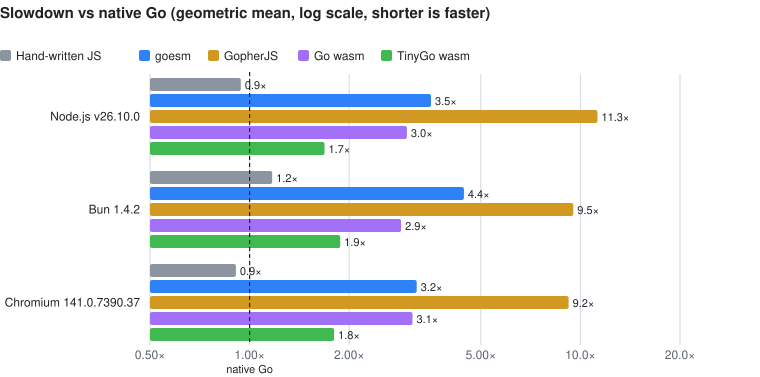
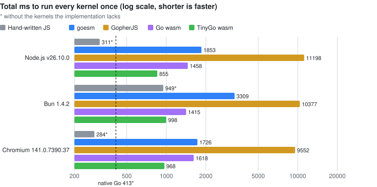

<h1 align="center"></h1>

[](https://github.com/goesm-dev/goesm/actions/workflows/ci.yml)
[](https://pkg.go.dev/github.com/goesm-dev/goesm)
[](go.mod)
[](https://github.com/goesm-dev/goesm/releases)
[](LICENSE)

[日本語](README.ja.md)

Compile Go packages into native ES modules, emitted as TypeScript. No WebAssembly.

goesm takes ordinary Go packages from an ordinary Go module and turns each one into an ES module that Vite, Rolldown, esbuild, Bun, Node.js or a browser can import directly. Exported Go functions become JavaScript functions, exported types become classes with TypeScript types, and Go's semantics (integer arithmetic, slices, maps, interfaces, goroutines, `defer` / `panic` / `recover`, generics, reflection) are preserved and checked against native Go.

> [!NOTE]
> goesm is experimental. See [Status](#status) for what works today and what does not.

```go
package cart

type Item struct {
	Name     string
	Price    int
	Quantity int
}

func Total(items []Item) int {
	total := 0
	for _, item := range items {
		total += item.Price * item.Quantity
	}
	return total
}

func Discount(total, percent int) int {
	return total * (100 - percent) / 100
}
```

```ts
import { Discount, Item, Total, $runtime as rt } from "./goesm-ts/example.com/app/cart.ts";

const items = rt.sliceLit([new Item(rt.fromJSString("apple"), 120, 3), new Item(rt.fromJSString("bread"), 250, 1)]);
Total(items);          // 610
Discount(2408, 15);    // 2046: Go's integer division, not 2046.8
```

## Why goesm

- **Go functions are JavaScript functions.** There is no WebAssembly instance, no `wasm_exec.js`, no asynchronous instantiation and no value marshalling through `syscall/js`: calling `Discount` costs what calling any JS function costs, and numbers, booleans and structs cross the boundary as they are.
- **One ES module per Go package.** The output is a tree of TypeScript modules that import each other with relative `.ts` specifiers, so the host's bundler does tree shaking, code splitting, minification and source maps (back to the `.go` files), and TypeScript sees the Go API's types.
- **Go stays Go.** goesm uses the Go toolchain itself (go/packages, go/types) as the frontend: `go.mod`, `go.work`, `gopls`, `go vet` and `go test` keep working on the same code, and there is no goesm-specific syntax. The standard library is compiled from Go's own source.
- **Checked against native Go.** Every fixture's results are compared with `go run`, and Go's own test suite (`$GOROOT/test`) runs through goesm.

## Status

The proof of concept compiles most of the Go language and a good part of the standard library:

- **Language:** functions and closures, structs, arrays, slices, maps, pointers, interfaces, type switches, generics (including Go 1.27 generic methods), method values, `defer` / `panic` / `recover`, goroutines, channels, `select`, range over integers and functions, `goto`, labeled statements, package initialization order.
- **Standard library**, compiled from Go source: `strings`, `strconv`, `unicode`, `sort`, `slices`, `maps`, `errors`, `math`, `math/bits`, `fmt`, `reflect`, `encoding/json`, `sync`, `time` (on the host's timers), `os` standard streams, and more. A function goesm cannot lower yet becomes a stub that panics if called; `goesm build -v` lists them.
- **Compile-time instrumentation:** `goesm build -toolexec "otelc toolexec"` builds a program instrumented by OpenTelemetry's [otelc](https://github.com/open-telemetry/opentelemetry-go-compile-instrumentation), and it emits the spans a native build does, to the console or to an OTLP/HTTP collector ([docs/otelc.md](docs/otelc.md)). `//go:linkname` between packages and `//go:embed` work too.
- **Go's test suite:** 898 of the 961 runnable tests in `$GOROOT/test` produce the output native Go does ([docs/conformance.md](docs/conformance.md)).
- **Use cases:** command-line tools (including cobra), build tools, server-side rendering, HTTP and Connect servers with `http.ListenAndServe` under Node.js, Bun and Deno, the same `http.Handler` as a Cloudflare Workers fetch handler, Connect clients, DOM code, and React, Preact or Next.js apps calling Go. [docs/use-cases.md](docs/use-cases.md) says what is supported where, how each is checked, and what is not supported yet.

Not there yet (details in [ARCHITECTURE.md §11](ARCHITECTURE.md#11-implemented--not-implemented--differences-from-native-go)):

- `int` and `uint` are JS numbers: exact below 2^53, but they do not wrap on 64-bit overflow. `int64` and `uint64` are exact (BigInt).
- There is no JS calling ABI yet: Go strings and slices are runtime objects, converted by hand with the runtime each module re-exports (`rt.fromJSString`, `rt.sliceLit`, `rt.toArray`, ...). Functions that may block return Promises.
- Goroutine-local `recover` state, deadlock detection while the host has pending work, DOM bindings.

## Install

goesm needs the Go toolchain (Go 1.27 or later; an older `go` downloads 1.27 by itself through `GOTOOLCHAIN`). It does not need Node.js or npm: the runtime (`@goesm/runtime`) is embedded in the binary and written into the output.

Add goesm as a tool of your module, so that it is built with the same toolchain as your code:

```sh
go get -tool github.com/goesm-dev/goesm/cmd/goesm@latest
go tool goesm emit-ts ./cart     # goesm-ts/<import path of cart>.ts + goesm-ts/@goesm/runtime/
```

or install it on your `PATH`:

```sh
go install github.com/goesm-dev/goesm/cmd/goesm@latest
```

There are no prebuilt binaries: goesm runs `go` anyway, and building it with your own toolchain keeps its go/types in step with the Go your module uses. While goesm is experimental, releases are prereleases named `v0.0.1-beta.N` ([GitHub Releases](https://github.com/goesm-dev/goesm/releases)); `@latest` resolves to the newest one. `goesm version` prints the goesm version and the Go it was built with.

## Usage

### `goesm emit-ts`: a TypeScript tree for your bundler

Inputs are ordinary Go package patterns in an ordinary Go module:

```sh
cd testdata/example
go run ../../cmd/goesm emit-ts -o goesm-ts ./main   # -o defaults to goesm-ts
```

```text
goesm-ts/
├── example.com/app/main.ts    import * as mathx from "./mathx.ts"
├── example.com/app/mathx.ts   import * as $rt from "../../@goesm/runtime/index.ts"
└── @goesm/runtime/
    ├── index.ts
    └── ...                    the other runtime files
```

The module of Go package `p` is `<dir>/<p>.ts`, standard library packages included (`strings.ts`, `internal/bytealg.ts`), and the runtime is `<dir>/@goesm/runtime/` (a Go import path cannot start with `@`). Modules import each other with relative specifiers ending in `.ts`, so no resolver, plugin or bundler configuration is needed. Import the entry package from your own code:

```ts
// index.ts in a Vite project, or run directly: bun index.ts / node index.ts (Node.js 22.18+)
import { Result } from "./goesm-ts/example.com/app/main.ts";
console.log(Result()); // 3
```

To type-check code that imports the tree with `tsc`, enable `allowImportingTsExtensions`. [docs/example-output.md](docs/example-output.md) shows the generated TypeScript and JavaScript.

### `goesm build`: a bundled ES module

`goesm build` writes the same tree to a temporary directory and bundles it with esbuild's Go API, for when there is no bundler (and for goesm's own tests):

```sh
go run ../../cmd/goesm build ./main            # dist/main.js (+ .js.map pointing at the .go files)
go run ../../cmd/goesm build -minify ./main
go run ../../cmd/goesm build -split ./main     # one ES module per Go package: dist/example.com/app/main.js, ...
```

```js
import { Result } from "./dist/main.js";
Result(); // 3
```

The output is ES modules with a `.js` extension. Under Node.js, load them from a package whose `package.json` says `"type": "module"`: otherwise Node.js parses each module a second time to detect its format, which for a large bundle adds tens of milliseconds to startup.

### Calling Go from JavaScript

- Exported functions and types are exports of the package's module, with their Go types in TypeScript (`Total(items: $rt.S<Item>): number`).
- Numbers and booleans are JS numbers and booleans; `int64` / `uint64` are BigInts. Structs are classes with positional constructors (`new Item(name, price, quantity)`).
- Go strings are byte strings: `rt.fromJSString(s)` in, `rt.toJSString(s)` out. Slices: `rt.sliceLit([...])` in, `rt.toArray(s)` out. Multiple results come back as an array, and an `error` as a Go interface value.
- A function that may block (channel operations, `time.Sleep`, waiting on a mutex) is an `async function` and returns a Promise; the others are synchronous.

`rt` is the runtime, which every module re-exports as `$runtime`. [examples/](examples) has runnable examples (the cart, standard library use, goroutines) with the JavaScript that calls them.

### Serving HTTP

An `http.Handler` (a `ServeMux`, a Connect service, middleware) serves requests on every host, through the host's own server:

```go
// Node.js, Bun and Deno: the host's HTTP server (node:http, Bun.serve, Deno.serve) runs it.
log.Fatal(http.ListenAndServe(":8080", api.Handler()))
```

```ts
// Cloudflare Workers (and Deno.serve, Bun.serve, service workers): a fetch handler.
import { Handler, $runtime as rt } from "./goesm-ts/example.com/app/api.ts";
export default { fetch: rt.fetchHandler(Handler()) };
```

Each request runs in its own goroutine, its body read in full first; the response is sent when the handler returns, or streams from its first flush (Server-Sent Events, Connect's server streaming). Under Workers, `os.Getenv` reads the Worker's text bindings and secrets with the `nodejs_compat` flag. The HTTP client is `fetch`. [docs/use-cases.md](docs/use-cases.md) lists what is supported where.

## Performance

[bench/](bench) runs the same Go kernels compiled by goesm, [GopherJS](https://github.com/gopherjs/gopherjs), Go's own `GOOS=js GOARCH=wasm` port and [TinyGo](https://tinygo.org)'s wasm target under Node.js, Bun and Chromium, checks every result against native Go, and also measures startup time and output size. Native Go and the same kernels written by hand in JavaScript are references. What each kernel does, how the outputs are built and called, and the fairness caveats are in [bench/README.md](bench/README.md). All numbers, per runtime, are in [bench/results/results.md](bench/results/results.md).

How the numbers are measured:

- Every implementation is measured on its prebuilt output. Building and the TypeScript-to-JavaScript step happen beforehand and are in no measured time. Loading the output, including compiling and instantiating wasm, is left out of the kernel times and counted in startup time.
- Native Go runs the same measuring loop in Go, inside a binary built with `go build`.
- Hand-written JS is [bench/js/handwritten.mjs](bench/js/handwritten.mjs), imported as an ES module as it is.
- For goesm, the TypeScript that `goesm build -minify` emits is bundled into one ES module, `kernels.js`, by the esbuild built into goesm, and that module is imported.
- For GopherJS, the script `gopherjs build -m` emits is loaded. For Go wasm and TinyGo wasm, the `.wasm` file and `wasm_exec.js` are loaded.
- Each kernel is called from JavaScript. After a warm-up of at least 300 ms and at least 3 calls, it is timed for at least 10 calls and at least 1000 ms, and the median is the result. A kernel whose calls are slow stops after at least 3 calls once 10 s have passed, even if it has fewer than 10 calls.
- Add, Upper and Handle measure one call of a function from JavaScript. For goesm and wasm, that time includes converting strings between JS and Go, because the caller pays for that conversion.

<!-- bench:start -->
- Intel(R) Xeon(R) Processor @ 2.10GHz (4 threads), linux 6.18.44-fc-v70
- goesm f8c5aba, go version go1.27.1 linux/amd64
- GopherJS 1.21.0+go1.21.13
- tinygo version 0.42.0 linux/amd64 (using go version go1.27.1 and LLVM version 22.1.4)
- Node.js v26.10.0, Bun 1.4.2, Chromium 141.0.7390.37
- 2026-10-04; warm-up ≥ 300 ms, then the median of ≥ 10 calls and ≥ 1000 ms per kernel, or of ≥ 3 calls once 10 s have passed for slow kernels





Slowdown against native Go, as the geometric mean of the per-kernel time ratios. Lower is better.

| Runtime | Hand-written JS | goesm | GopherJS | Go wasm | TinyGo wasm |
| --- | ---: | ---: | ---: | ---: | ---: |
| Node.js v26.10.0 | 1.03× | **1.25×** | 10.39× | 2.46× | 1.90× |
| Bun 1.4.2 | 1.08× | **1.39×** | 8.37× | 2.25× | 2.23× |
| Chromium 141.0.7390.37 | 0.95× | **1.23×** | 8.74× | 2.63× | 1.99× |

Total ms to run every kernel once: the sum of the medians, with the calling kernels' whole loops included. A value marked * leaves out the kernels that implementation lacks. Lower is better.

| Runtime | Hand-written JS | goesm | GopherJS | Go wasm | TinyGo wasm |
| --- | ---: | ---: | ---: | ---: | ---: |
| Node.js v26.10.0 | 296* | **410** | 8387 | 1011 | 1074 |
| Bun 1.4.2 | 685* | **853** | 6697 | 923 | 1271 |
| Chromium 141.0.7390.37 | 244* | **378** | 6919 | 1153 | 1182 |

Median ms per call under Node.js v26.10.0. The rows marked ns/call give the time of one call from JS in ns. Lower is better.

| Kernel | Exercises | Native Go | Hand-written JS | goesm | GopherJS | Go wasm | TinyGo wasm |
| --- | --- | ---: | ---: | ---: | ---: | ---: | ---: |
| Fib | recursive calls, int arithmetic | 4.03 | 7.68 | 7.59 | 7.50 | 11.3 | **3.87** |
| Sieve | []bool, tight loops | 6.45 | 9.40 | 9.09 | 55.9 | 10.9 | **8.96** |
| Mandelbrot | float64 loops | 9.88 | 11.6 | 10.9 | 11.5 | 11.4 | **10.1** |
| NBody | float64 struct fields via pointers | 8.01 | 7.69 | 9.14 | 666 | 8.75 | **6.13** |
| FNV32 | uint32 multiply and xor | 11.0 | 10.9 | **10.7** | 15.8 | 11.0 | 11.5 |
| FNV64 | uint64 multiply and xor | 11.2 | 44.5 | 41.2 | 267 | 13.4 | **10.8** |
| BinaryTrees | allocation, GC | 57.6 | 45.9 | **36.6** | 60.2 | 210 | 363 |
| Interfaces | interface method calls | 17.2 | 13.3 | **20.8** | 42.1 | 64.0 | 23.9 |
| MapInt | map[int]int insert, lookup, delete | 25.5 | 38.2 | **26.8** | 49.9 | 51.1 | 125 |
| MapString | map[string]int counting | 7.20 | 23.2 | **17.7** | 107 | 22.5 | 59.0 |
| Strings | strings.Builder, strconv, Split, Join | 7.90 | 11.0 | 16.2 | 463 | 26.7 | **10.2** |
| Sort | sort.Ints, sort.Strings | 29.6 | 46.6 | 49.3 | 148 | 103 | **36.7** |
| JSON | encoding/json Marshal + Unmarshal | 7.22 | 2.42 | **4.28** | 443 | 20.6 | 29.2 |
| Sprintf | fmt.Sprintf | 13.5 | 5.64 | **14.0** | 1261 | 51.2 | 29.5 |
| Channels | goroutines, unbuffered channels | 76.7 | — | 94.5 | 252 | 182 | **19.9** |
| Add, ns/call | calls from JS: two numbers in, one out | — | 0.62 | **0.61** | 2764 | 5.08 | 1.75 |
| Upper, ns/call | calls from JS: strings.ToUpper, a string in and out | 139 | 48.8 | **110** | 12373 | 830 | 673 |
| Handle, ns/call | calls from JS: a JSON request handler, a string in and out | 3109 | 1318 | **2999** | 302264 | 12960 | 25846 |
| **Total ms, every kernel once** | | 338* | 296* | **410** | 8387 | 1011 | 1074 |
| **Geometric mean vs native Go** | | 1.00× | 1.03× | **1.25×** | 10.39× | 2.46× | 1.90× |

Startup in ms, from starting to load the output to the first callable function.

| Runtime | goesm | GopherJS | Go wasm | TinyGo wasm |
| --- | ---: | ---: | ---: | ---: |
| Node.js | 88.1 | 88.4 | 47.2 | **20.4** |
| Bun | 162 | 222 | 47.1 | **15.5** |
| Chromium | 75.1 | 67.5 | 68.7 | **24.0** |

Output size, covering all kernels and the standard library they use.

| | goesm | GopherJS | Go wasm | TinyGo wasm |
| --- | ---: | ---: | ---: | ---: |
| Files | `kernels.js` | `bench.js` | `bench.wasm` + `wasm_exec.js` | `bench.wasm` + `wasm_exec.js` |
| Raw | **872 KiB** | 1153 KiB | 4393 KiB | 1104 KiB |
| gzip -9 | 237 KiB | **228 KiB** | 1211 KiB | 406 KiB |
| brotli -11 | 188 KiB | **169 KiB** | 894 KiB | 299 KiB |
<!-- bench:end -->

What these numbers say about goesm today:

- **Total time: goesm is the fastest of the four on every runtime.** Running every kernel once takes goesm 0.38–0.85 s, Go wasm 0.92–1.15 s, TinyGo 1.07–1.27 s and GopherJS 6.7–8.4 s; hand-written JS takes 0.24–0.69 s without Channels. In geometric mean against native Go that is 1.23–1.39× for goesm (4.2–4.6× before optimization started), 0.95–1.08× for hand-written JS, 2.25–2.63× for Go wasm, 1.90–2.23× for TinyGo and 8.37–10.39× for GopherJS.
- **The geometric mean is what is left after slower and faster kernels cancel out.** Under Node.js, hand-written JS takes 1.9× native Go's time on Fib, 4.0× on FNV64 and 3.2× on MapString, but only 0.34× on JSON, 0.42× on Sprintf and 0.35× on Upper, because the JS engine's built-ins for JSON and strings are faster than Go's standard library. goesm shows the same pattern: it takes 0.97–3.7× native Go's time on the numeric kernels and less time than native Go on JSON, Upper and BinaryTrees.
- **Crossing from JavaScript is free for numbers and cheaper than wasm for strings.** A goesm function is a JS function, so `Add` costs what it costs in hand-written JS (0.6 ns). Through plain wasm exports, TinyGo takes 1.8–2.4 ns and Go wasm 4.7–6.0 ns (microseconds through `syscall/js`); GopherJS takes 1.8–2.8 µs. With a string in and out (`Upper`), goesm takes 103–110 ns per call against 0.7–1.5 µs in wasm (hand-written JS: 49–54 ns). The JSON request handler takes goesm 3.0–3.9 µs per call, against 12.6–13.9 µs for Go wasm and 26–34 µs for TinyGo (hand-written JS: 0.95–1.3 µs).
- **Where goesm matches hand-written JS and where it lags.** It is within about 20% of hand-written JS, or ahead of it, on Fib, Sieve, Mandelbrot, NBody, FNV32, FNV64, BinaryTrees, the map kernels and Sort under Node.js. It is furthest from hand-written JS on Sprintf (2.2–2.5×), the JSON handler (2.3–3.9×), Upper (1.9–2.3×), JSON (1.8–2.2×) and Interfaces (1.5–1.8×, where every value stored in an interface is boxed). FNV64 uses BigInt like the hand-written JS, which is slow under Bun.
- **Startup is slower than wasm, and size is close to GopherJS.** goesm's output starts in 75–162 ms, against 47–69 ms for Go wasm and 16–24 ms for TinyGo. It is 188 KiB with brotli, against 169 KiB for GopherJS, 299 KiB for TinyGo and 894 KiB for Go wasm.
- **What remains is representation, not lowering overhead.** The kernels that still trail hand-written JS spend their time on boxed interface values, Go's byte strings at the JS boundary, and `fmt` and `encoding/json` working over bytes, which is where optimization continues.

## How it works

```text
.go ──► go/packages + go/types ──► goesm: Go semantics → TypeScript ──► your bundler / runtime ──► ES modules
         (the Go toolchain)                                              (Vite, Rolldown, esbuild, Bun, Node.js)
```

goesm uses the Go toolchain as the authority on the source language and modern JS tooling as the authority on the output. It does not replace the Go parser, type system or modules, and it does not implement a bundler: it lowers type-checked Go to TypeScript, plus a small runtime written in TypeScript. Some choices, all described in [ARCHITECTURE.md](ARCHITECTURE.md):

- A Go package is the unit of compilation, not a Go program: a goesm project does not need `package main`, and the JS application decides where execution starts.
- Goroutines are cooperative. A whole-program analysis finds the functions that may block; those become `async` functions with `await` at their blocking points, and everything else stays plain synchronous JavaScript.
- Standard library packages are compiled from Go's own source. The few tied to the gc runtime (`runtime`, `reflect`, `internal/reflectlite`, `sync`, `syscall/js`) are replaced by goesm's own Go source, and functions without a Go body are implemented in the runtime.
- Each Go type has a runtime type descriptor, which interfaces, generics (type dictionaries), maps with struct keys and reflection use.

[docs/gopherjs-comparison.md](docs/gopherjs-comparison.md) compares the design with GopherJS'.

### Goals and non-goals

goesm aims to keep the Go development experience as it is (`go.mod`, `go.work`, `go fmt`, `gopls`, `go test`, `go vet`, `golangci-lint`, `govulncheck`) and to reuse the JavaScript ecosystem's tools at the other end.

It is not a Go-inspired language, a WebAssembly runtime, a package manager, a replacement for Vite or Rolldown, or a framework. Framework integration belongs in separate adapters: a Vue SFC with `<script setup lang="go">`, for example, can hand its Go to goesm while Vue keeps the template layer.

## Documentation

- [ARCHITECTURE.md](ARCHITECTURE.md): the design, value representation, goroutines, the standard library, what is implemented and the differences from native Go
- [docs/use-cases.md](docs/use-cases.md): what is supported on Node.js, the edge and in browsers, and what is not yet
- [docs/example-output.md](docs/example-output.md): generated TypeScript and JavaScript
- [docs/conformance.md](docs/conformance.md): running Go's own test suite through goesm
- [docs/otelc.md](docs/otelc.md): OpenTelemetry compile-time instrumentation (otelc) with goesm
- [docs/gopherjs-comparison.md](docs/gopherjs-comparison.md): how goesm differs from GopherJS
- [bench/README.md](bench/README.md): the benchmark
- [examples/](examples): runnable examples
- [CONTRIBUTING.md](CONTRIBUTING.md): development setup, principles and what a pull request needs
- [docs/releasing.md](docs/releasing.md): how releases are made

## Development

```sh
mise install           # Go, Node.js and Bun at the versions pinned in mise.toml (CI uses the same)
npm ci --prefix test   # tsc, oxlint and workerd for TestTSC / TestOxlint / TestUseCaseEdge (optional locally; required in CI)
go test ./...          # needs Go 1.27+ and Node.js 22.18+; Bun is optional
```

`TestGolden` runs every parameterless exported function of the fixtures under native Go and in the goesm-built ESM and requires equal results; `TestExamples`, `TestJS`, `TestTSC` (strict type-checking of the emitted TypeScript), `TestOxlint` and the opt-in `TestGoConformance` cover the rest. [CONTRIBUTING.md](CONTRIBUTING.md) describes each test and what a pull request needs.

## License

goesm is released under the [BSD 3-Clause License](LICENSE). The output of `emit-ts` and `build` includes the Go standard library packages your code uses, compiled from Go's source, which are under [Go's own BSD-style license](https://go.dev/LICENSE).
