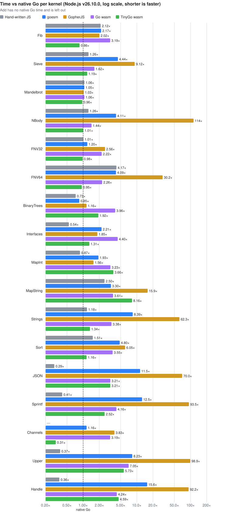
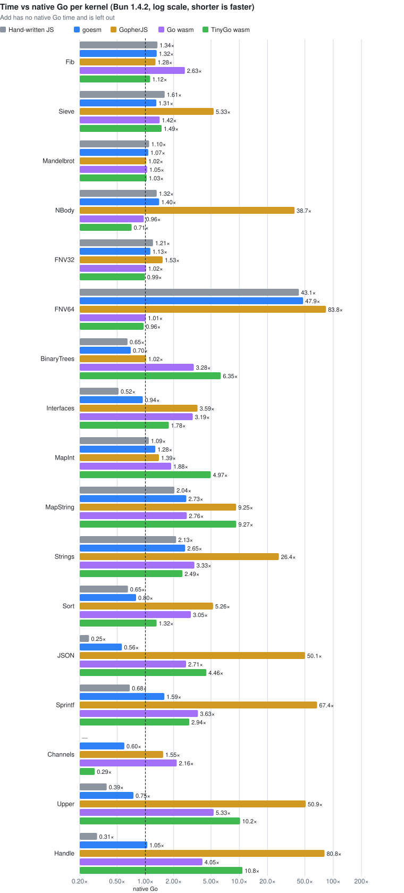
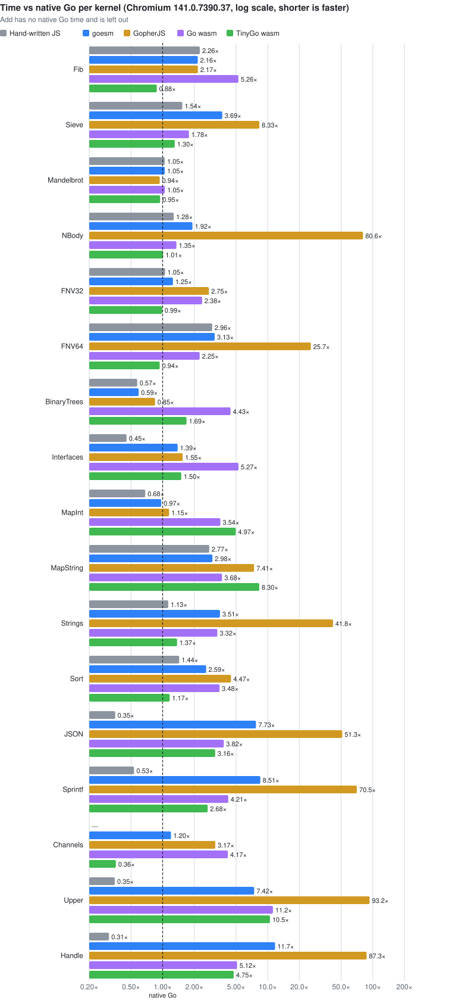

# Benchmark results

Generated by `bench/js/compare.mjs`; see [bench/README.md](../README.md) for what is measured and how. Lower is better everywhere; the fastest of goesm, GopherJS, Go wasm and TinyGo wasm is in bold (native Go and hand-written JS are references).

- Intel(R) Xeon(R) Processor @ 2.80GHz (4 threads), linux 6.18.44-fc-v70
- goesm f2910eb, go version go1.27.1 linux/amd64
- GopherJS 1.21.0+go1.21.13
- tinygo version 0.42.0 linux/amd64 (using go version go1.27.1 and LLVM version 22.1.4)
- Node.js v26.10.0, Bun 1.4.2, Chromium 141.0.7390.37
- 2026-10-05; warm-up ≥ 300 ms, then the median of ≥ 10 calls and ≥ 1000 ms per kernel, or of ≥ 3 calls once 10 s have passed for slow kernels

## Slowdown vs native Go (geometric mean over the kernels)

| Runtime | Hand-written JS | goesm | GopherJS | Go wasm | TinyGo wasm |
| --- | ---: | ---: | ---: | ---: | ---: |
| Node.js v26.10.0 | 0.97× | **1.14×** | 11.37× | 2.78× | 1.73× |
| Bun 1.4.2 | 1.38× | **1.15×** | 10.59× | 3.05× | 1.90× |
| Chromium 141.0.7390.37 | 0.92× | **1.06×** | 9.61× | 3.05× | 1.79× |

## Total: ms to run every kernel once

The sum of the medians, the calling kernels' whole loops included; * marks a total without the kernels the implementation lacks (native Go has no Add, hand-written JS no Channels).

| Runtime | Hand-written JS | goesm | GopherJS | Go wasm | TinyGo wasm |
| --- | ---: | ---: | ---: | ---: | ---: |
| Node.js v26.10.0 | 407* | **569** | 15305 | 1884 | 1186 |
| Bun 1.4.2 | 1335* | **538** | 15170 | 1878 | 1338 |
| Chromium 141.0.7390.37 | 367* | **503** | 12336 | 2127 | 1269 |

## Worst kernel

The kernel, cliffs included, on which each implementation is the slowest relative to native Go and to hand-written JS.

| Runtime | | goesm | GopherJS | Go wasm | TinyGo wasm |
| --- | --- | ---: | ---: | ---: | ---: |
| Node.js v26.10.0 | Worst kernel vs native Go | 55.0× RSASign | 327× RSASign | **8.12× Upper** | 8.61× Upper |
| Node.js v26.10.0 | Worst kernel vs hand-written JS | 88.3× RSASign | 10672× Add | **21.0× Upper** | 22.3× Upper |
| Bun 1.4.2 | Worst kernel vs native Go | 141× Rand64 | 631× RSASign | **6.13× RSASign** | 12.0× RSASign |
| Bun 1.4.2 | Worst kernel vs hand-written JS | 98.2× RSASign | 3598× Add | **14.0× Upper** | 27.9× Pull |
| Chromium 141.0.7390.37 | Worst kernel vs native Go | 57.5× RSASign | 277× RSASign | **11.6× Upper** | 11.8× Upper |
| Chromium 141.0.7390.37 | Worst kernel vs hand-written JS | 129× RSASign | 8009× Add | **31.4× Upper** | 31.9× Upper |

## Node.js v26.10.0: median ms per call

| Kernel | Exercises | Native Go | Hand-written JS | goesm | GopherJS | Go wasm | TinyGo wasm |
| --- | --- | ---: | ---: | ---: | ---: | ---: | ---: |
| Fib | recursive calls, int arithmetic | 4.80 | 12.5 | 13.1 | 13.1 | 18.3 | **5.43** |
| Sieve | []bool, tight loops | 10.8 | 13.7 | 17.5 | 115 | 18.5 | **12.6** |
| Mandelbrot | float64 loops | 16.5 | 16.1 | 16.0 | 16.0 | 16.6 | **15.0** |
| NBody | float64 struct fields via pointers | 11.1 | 15.1 | 18.6 | 1210 | 15.1 | **11.8** |
| FNV32 | uint32 multiply and xor | 12.0 | 11.9 | 12.0 | 28.8 | 22.5 | **11.4** |
| FNV64 | uint64 multiply and xor | 11.5 | 57.6 | 21.4 | 457 | 23.6 | **11.2** |
| BinaryTrees | allocation, GC | 90.3 | 58.3 | **76.1** | 91.9 | 407 | 210 |
| Interfaces | interface method calls | 43.1 | 15.1 | **31.8** | 56.8 | 121 | 42.3 |
| MapInt | map[int]int insert, lookup, delete | 63.9 | 43.6 | 80.7 | **79.2** | 131 | 184 |
| MapString | map[string]int counting | 12.5 | 28.7 | **24.4** | 201 | 37.3 | 84.9 |
| Strings | strings.Builder, strconv, Split, Join | 12.2 | 19.9 | 21.8 | 803 | 42.8 | **17.8** |
| Sort | sort.Ints, sort.Strings | 40.8 | 70.0 | 70.8 | 225 | 142 | **53.4** |
| JSON | encoding/json Marshal + Unmarshal | 13.3 | 5.11 | **5.98** | 900 | 35.8 | 33.4 |
| Sprintf | fmt.Sprintf | 24.4 | 11.6 | **16.5** | 2020 | 77.3 | 58.1 |
| Channels | goroutines, unbuffered channels | 125 | — | 91.0 | 512 | 330 | **64.5** |
| Add, ns/call | calls from JS: two numbers in, one out | — | 0.59 | **0.59** | 6314 | 7.02 | 2.14 |
| Upper, ns/call | calls from JS: strings.ToUpper, a string in and out | 186 | 72.0 | **198** | 21159 | 1513 | 1604 |
| Handle, ns/call | calls from JS: a JSON request handler, a string in and out | 4852 | 2010 | **3095** | 582772 | 29347 | 20886 |
| **Total ms, every kernel once** | | 560* | 407* | **569** | 15305 | 1884 | 1186 |
| **Geometric mean vs native Go** | | 1.00× | 0.97× | **1.14×** | 11.37× | 2.78× | 1.73× |

Cliffs:

| Kernel | Exercises | Native Go | Hand-written JS | goesm | GopherJS | Go wasm | TinyGo wasm |
| --- | --- | ---: | ---: | ---: | ---: | ---: | ---: |
| Parallel | CPU work split over 4 goroutines | 8.72 | 42.5 | 33.1 | 60.3 | 47.6 | **12.2** |
| Rand64 | uint64 arithmetic on a struct field | 2.80 | 24.0 | 134 | 177 | 3.63 | **2.25** |
| MaybeBlocking | interface calls of which another implementation blocks | 1.63 | 0.97 | 4.90 | 2.60 | 2.62 | **0.47** |
| Pull | iter.Pull | 4.42 | 1.17 | 70.7 | — | **12.9** | 23.6 |
| RSASign | crypto/rsa 2048-bit signatures, math/big | 6.09 | 3.80 | 335 | 1992 | **32.7** | 51.3 |

## Bun 1.4.2: median ms per call

| Kernel | Exercises | Native Go | Hand-written JS | goesm | GopherJS | Go wasm | TinyGo wasm |
| --- | --- | ---: | ---: | ---: | ---: | ---: | ---: |
| Fib | recursive calls, int arithmetic | 4.80 | 8.10 | 9.04 | 8.36 | 19.2 | **6.31** |
| Sieve | []bool, tight loops | 10.8 | 15.2 | **13.4** | 74.2 | 18.4 | 17.7 |
| Mandelbrot | float64 loops | 16.5 | 16.5 | 17.5 | 15.6 | 18.9 | **15.2** |
| NBody | float64 struct fields via pointers | 11.1 | 19.0 | 25.0 | 632 | 14.7 | **11.6** |
| FNV32 | uint32 multiply and xor | 12.0 | 14.5 | 14.7 | 20.4 | 45.4 | **11.7** |
| FNV64 | uint64 multiply and xor | 11.5 | 894 | 25.9 | 1891 | 28.5 | **11.8** |
| BinaryTrees | allocation, GC | 90.3 | 87.5 | **85.5** | 104 | 349 | 179 |
| Interfaces | interface method calls | 43.1 | 28.5 | **36.0** | 102 | 146 | 54.1 |
| MapInt | map[int]int insert, lookup, delete | 63.9 | 64.3 | **59.1** | 80.1 | 122 | 212 |
| MapString | map[string]int counting | 12.5 | 39.6 | **35.6** | 120 | 51.7 | 88.4 |
| Strings | strings.Builder, strconv, Split, Join | 12.2 | 43.9 | 30.8 | 468 | 43.8 | **20.7** |
| Sort | sort.Ints, sort.Strings | 40.8 | 46.2 | **40.6** | 346 | 155 | 51.0 |
| JSON | encoding/json Marshal + Unmarshal | 13.3 | 3.87 | **6.23** | 876 | 46.7 | 49.0 |
| Sprintf | fmt.Sprintf | 24.4 | 23.4 | **19.2** | 1932 | 92.8 | 73.5 |
| Channels | goroutines, unbuffered channels | 125 | — | 73.6 | 258 | 332 | **47.8** |
| Add, ns/call | calls from JS: two numbers in, one out | — | 1.03 | **0.88** | 3708 | 6.84 | 4.93 |
| Upper, ns/call | calls from JS: strings.ToUpper, a string in and out | 186 | 80.6 | **198** | 19543 | 1125 | 1240 |
| Handle, ns/call | calls from JS: a JSON request handler, a string in and out | 4852 | 2157 | **2648** | 591774 | 28005 | 36394 |
| **Total ms, every kernel once** | | 560* | 1335* | **538** | 15170 | 1878 | 1338 |
| **Geometric mean vs native Go** | | 1.00× | 1.38× | **1.15×** | 10.59× | 3.05× | 1.90× |

Cliffs:

| Kernel | Exercises | Native Go | Hand-written JS | goesm | GopherJS | Go wasm | TinyGo wasm |
| --- | --- | ---: | ---: | ---: | ---: | ---: | ---: |
| Parallel | CPU work split over 4 goroutines | 8.72 | 74.7 | 62.8 | 59.2 | 43.0 | **19.7** |
| Rand64 | uint64 arithmetic on a struct field | 2.80 | 410 | 396 | 595 | 3.04 | **2.44** |
| MaybeBlocking | interface calls of which another implementation blocks | 1.63 | 1.63 | 5.80 | 6.15 | 1.97 | **0.22** |
| Pull | iter.Pull | 4.42 | 0.80 | 76.3 | — | **9.88** | 22.4 |
| RSASign | crypto/rsa 2048-bit signatures, math/big | 6.09 | 4.19 | 412 | 3847 | **37.4** | 73.2 |

## Chromium 141.0.7390.37: median ms per call

| Kernel | Exercises | Native Go | Hand-written JS | goesm | GopherJS | Go wasm | TinyGo wasm |
| --- | --- | ---: | ---: | ---: | ---: | ---: | ---: |
| Fib | recursive calls, int arithmetic | 4.80 | 15.3 | 12.7 | 12.4 | 17.0 | **4.91** |
| Sieve | []bool, tight loops | 10.8 | 15.0 | 18.4 | 103 | 19.7 | **14.4** |
| Mandelbrot | float64 loops | 16.5 | 15.0 | **15.3** | 15.6 | 17.2 | 15.8 |
| NBody | float64 struct fields via pointers | 11.1 | 16.0 | 17.9 | 888 | 16.1 | **11.8** |
| FNV32 | uint32 multiply and xor | 12.0 | 12.2 | 12.5 | 39.1 | 23.2 | **11.2** |
| FNV64 | uint64 multiply and xor | 11.5 | 38.6 | 20.4 | 393 | 23.5 | **11.0** |
| BinaryTrees | allocation, GC | 90.3 | 43.7 | **46.9** | 75.7 | 461 | 177 |
| Interfaces | interface method calls | 43.1 | 13.3 | **22.9** | 42.8 | 127 | 54.8 |
| MapInt | map[int]int insert, lookup, delete | 63.9 | 33.6 | **36.7** | 77.1 | 145 | 201 |
| MapString | map[string]int counting | 12.5 | 38.1 | **30.3** | 129 | 37.9 | 103 |
| Strings | strings.Builder, strconv, Split, Join | 12.2 | 21.3 | 25.8 | 611 | 52.3 | **18.6** |
| Sort | sort.Ints, sort.Strings | 40.8 | 65.4 | 94.3 | 202 | 143 | **49.9** |
| JSON | encoding/json Marshal + Unmarshal | 13.3 | 4.64 | **7.46** | 785 | 47.6 | 35.0 |
| Sprintf | fmt.Sprintf | 24.4 | 13.1 | **13.3** | 1541 | 88.4 | 58.6 |
| Channels | goroutines, unbuffered channels | 125 | — | 80.2 | 335 | 422 | **44.1** |
| Add, ns/call | calls from JS: two numbers in, one out | — | 0.60 | **0.60** | 4806 | 9.70 | 3.95 |
| Upper, ns/call | calls from JS: strings.ToUpper, a string in and out | 186 | 68.8 | **198** | 17799 | 2162 | 2197 |
| Handle, ns/call | calls from JS: a JSON request handler, a string in and out | 4852 | 1509 | **2850** | 482424 | 26975 | 23875 |
| **Total ms, every kernel once** | | 560* | 367* | **503** | 12336 | 2127 | 1269 |
| **Geometric mean vs native Go** | | 1.00× | 0.92× | **1.06×** | 9.61× | 3.05× | 1.79× |

Cliffs:

| Kernel | Exercises | Native Go | Hand-written JS | goesm | GopherJS | Go wasm | TinyGo wasm |
| --- | --- | ---: | ---: | ---: | ---: | ---: | ---: |
| Parallel | CPU work split over 4 goroutines | 8.72 | 34.0 | 39.3 | 225 | 53.7 | **12.2** |
| Rand64 | uint64 arithmetic on a struct field | 2.80 | 11.6 | 125 | 130 | 3.00 | **2.29** |
| MaybeBlocking | interface calls of which another implementation blocks | 1.63 | 1.21 | 3.21 | 4.06 | 2.73 | **0.46** |
| Pull | iter.Pull | 4.42 | 1.47 | 58.2 | — | **14.5** | 17.2 |
| RSASign | crypto/rsa 2048-bit signatures, math/big | 6.09 | 2.72 | 351 | 1689 | **37.7** | 53.6 |

## Startup: ms from loading the output to the first callable function

| Runtime | goesm | GopherJS | Go wasm | TinyGo wasm |
| --- | ---: | ---: | ---: | ---: |
| Node.js | 220 | 217 | 82.0 | **64.8** |
| Bun | 496 | 474 | 115 | **50.1** |
| Chromium | 221 | 196 | 145 | **60.7** |

## Output size

| | goesm | GopherJS | Go wasm | TinyGo wasm |
| --- | ---: | ---: | ---: | ---: |
| Files | `kernels.js` | `bench.js` | `bench.wasm` + `wasm_exec.js` | `bench.wasm` + `wasm_exec.js` |
| Raw | **1221 KiB** | 1633 KiB | 5070 KiB | 1338 KiB |
| gzip -9 | 349 KiB | **331 KiB** | 1399 KiB | 504 KiB |
| brotli -11 | 277 KiB | **242 KiB** | 1028 KiB | 363 KiB |
